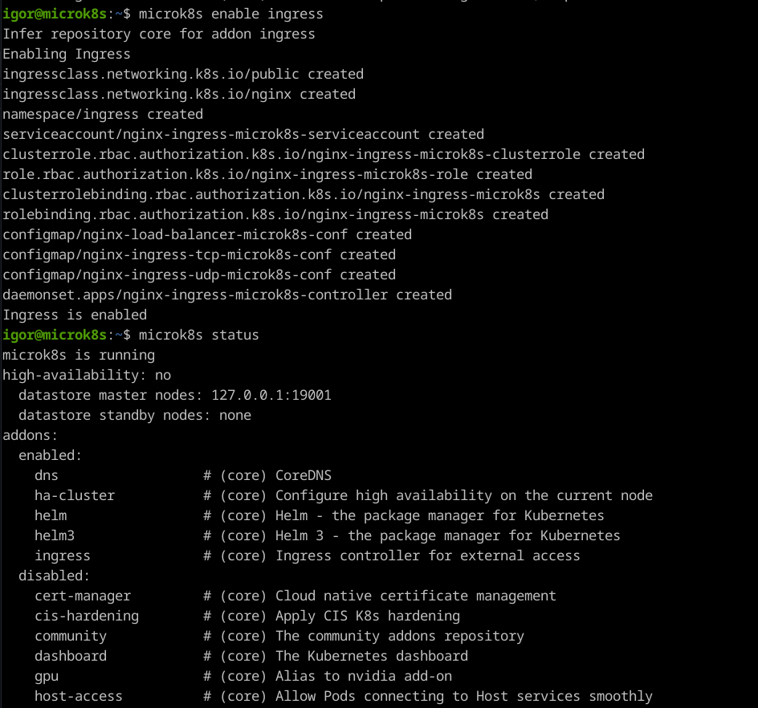

# Домашнее задание к занятию «`Сетевое взаимодействие в K8S. Часть 2`» - `Живарев Игорь`

### Цель задания

В тестовой среде Kubernetes необходимо обеспечить доступ к двум приложениям снаружи кластера по разным путям.

------

### Чеклист готовности к домашнему заданию

1. Установленное k8s-решение (например, MicroK8S).
2. Установленный локальный kubectl.
3. Редактор YAML-файлов с подключённым Git-репозиторием.

------

### Инструменты и дополнительные материалы, которые пригодятся для выполнения задания

1. [Инструкция](https://microk8s.io/docs/getting-started) по установке MicroK8S.
2. [Описание](https://kubernetes.io/docs/concepts/services-networking/service/) Service.
3. [Описание](https://kubernetes.io/docs/concepts/services-networking/ingress/) Ingress.
4. [Описание](https://github.com/wbitt/Network-MultiTool) Multitool.

------

### Задание 1. Создать Deployment приложений backend и frontend

1. Создать Deployment приложения _frontend_ из образа nginx с количеством реплик 3 шт.
2. Создать Deployment приложения _backend_ из образа multitool. 
3. Добавить Service, которые обеспечат доступ к обоим приложениям внутри кластера. 
4. Продемонстрировать, что приложения видят друг друга с помощью Service.
5. Предоставить манифесты Deployment и Service в решении, а также скриншоты или вывод команды п.4.

------

### Задание 2. Создать Ingress и обеспечить доступ к приложениям снаружи кластера

1. Включить Ingress-controller в MicroK8S.
2. Создать Ingress, обеспечивающий доступ снаружи по IP-адресу кластера MicroK8S так, чтобы при запросе только по адресу открывался _frontend_ а при добавлении /api - _backend_.
3. Продемонстрировать доступ с помощью браузера или `curl` с локального компьютера.
4. Предоставить манифесты и скриншоты или вывод команды п.2.

------

### Правила приема работы

1. Домашняя работа оформляется в своем Git-репозитории в файле README.md. Выполненное домашнее задание пришлите ссылкой на .md-файл в вашем репозитории.
2. Файл README.md должен содержать скриншоты вывода необходимых команд `kubectl` и скриншоты результатов.
3. Репозиторий должен содержать тексты манифестов или ссылки на них в файле README.md.

---


## Ответ


### Задание 1. Создать Deployment приложений backend и frontend

1. Создать Deployment приложения _frontend_


2. Создать Deployment приложения _backend_


Проверяем запуск и поднятие `Pod`  


4. Подключаемся к `Pod` с `nginx` и проверяем доступ с помощью `curl` по доменному имени `Service`  


Подключаемся к `Pod` с `multitool` и проверяем доступ с помощью `curl` по доменному имени `Service`  


Листинг `Deployment` _backend_:
```
apiVersion: apps/v1
kind: Deployment
metadata:
  name: multitool
  namespace: netology
spec:
  replicas: 1
  selector:
    matchLabels:
      app: multitool
  template:
    metadata:
      labels:
        app: multitool
    spec:
      containers:
        - image: wbitt/network-multitool
          name: multitool

---
apiVersion: v1
kind: Service
metadata:
  name: srv-multitool
  namespace: netology
spec:
  ports:
    - name: multitool
      port: 80
  selector:
    app: multitool
```

Листинг `Deployment` _frontend_:
```
apiVersion: apps/v1
kind: Deployment
metadata:
  name: nginx
  namespace: netology
  labels:
    app: nginx
spec:
  replicas: 3
  selector:
    matchLabels:
      app: nginx
  template:
    metadata:
      labels:
        app: nginx
    spec:
      containers:
      - name: nginx
        image: nginx:1.19.2
        ports:
        - containerPort: 80

---
apiVersion: v1
kind: Service
metadata:
  name: srv-nginx
  namespace: netology
spec:
  ports:
    - name: nginx
      port: 80
  selector:
    app: nginx
```


### Задание 2. Создать Ingress и обеспечить доступ к приложениям снаружи кластера

Установка `Ingress`  


Манифест и запуск `Ingress`


Проверяем работоспособность `Ingress`


Проверяем доступность с помощью браузера  


Листинг `Ingress`:
```
apiVersion: networking.k8s.io/v1
kind: Ingress
metadata:
  name: ingress
  namespace: netology
  annotations:
    nginx.ingress.kubernetes.io/rewrite-target: /
spec:
  rules:
    - host: ingress.flid.ru
      http:
        paths:
          - path: /
            pathType: Prefix
            backend:
              service:
                name: srv-nginx
                port:
                  name: nginx
          - path: /api
            pathType: Prefix
            backend:
              service:
                name: srv-multitool
                port:
                  name: multitool
```

---